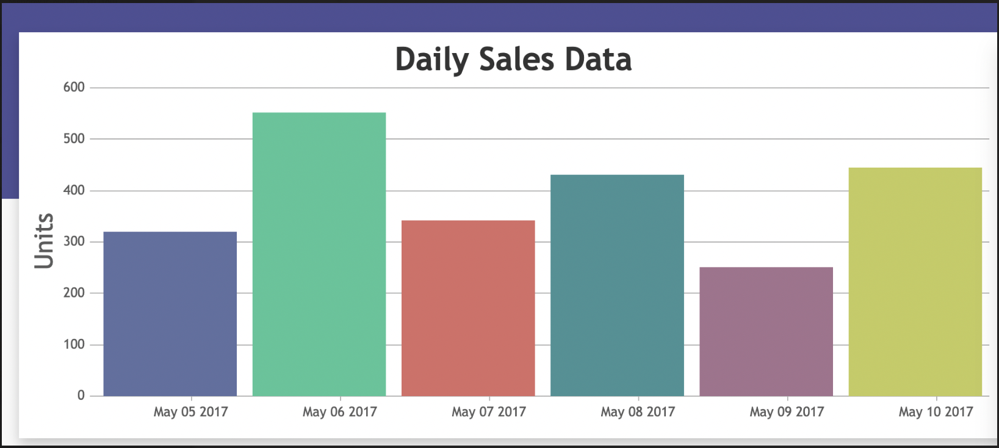
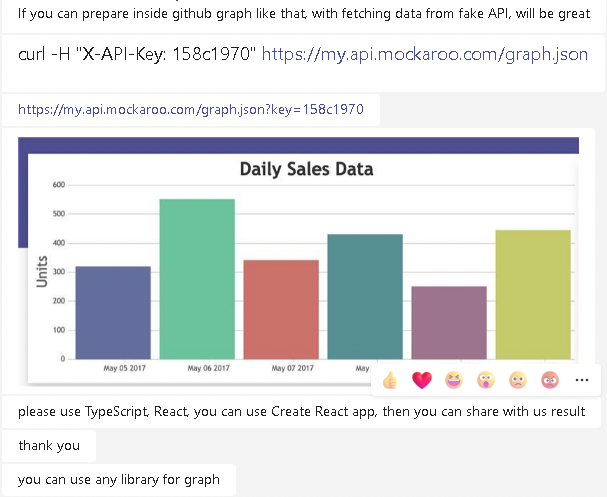

### Exercise 


If you can prepare inside Github graph like that, with fetching data from fake API, will be great.


```bash
CURL -H "X-API-Key": "158c1970" https://my.api.mockaroo.com/graph.json
```

> Example data:
```json
[{"date":"20/03/2022","units":52},{"date":"13/10/2021","units":44},{"date":"27/11/2021","units":74},{"date":"25/04/2022","units":71},{"date":"24/04/2022","units":81},{"date":"12/04/2022","units":49},{"date":"18/07/2022","units":100},{"date":"05/11/2021","units":47},{"date":"03/10/2021","units":54},{"date":"01/10/2021","units":46}]
```

https://my.api.mockaroo.com/graph.json?key=158c1970



Please use Typescript React, you can use create react app then share with us the results.

You can use any library for graph.

Thank you.




