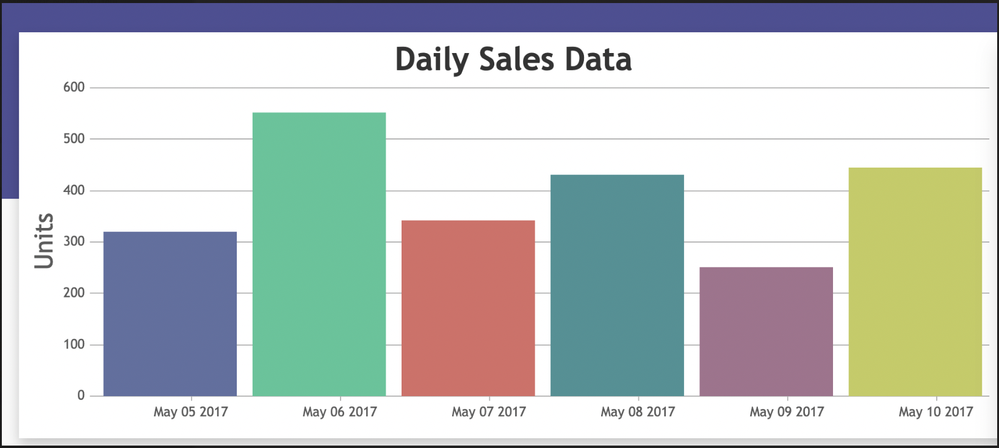
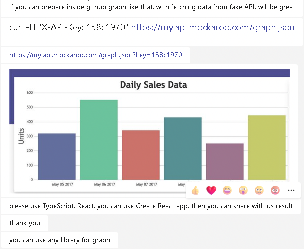

### Exercise 


If you can prepare inside Github graph like that, with fetching data from fake API, will be great.


```bash
CURL -H "X-API-Key": "158c1970" https://my.api.mockaroo.com/graph.json
```

https://my.api.mockaroo.com/graph.json?key=158c1970



Please use Typescript React, you can use create react app then share with us the results.

You can use any library for graph.

Thank you.




